<div align="center">

# WebKitty

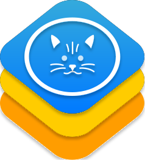

**A modular collection of WebKit-based exploit chains for the PlayStation 4.**

*(Formerly known as PSFree Enhanced)*

[](LICENSE)
[](https://github.com/ArabPixel/WebKitty/issues)
[](https://github.com/ArabPixel/WebKitty/stargazers)

[Features](#features) • [Firmware Compatibility](#supported-by-this-repository) • [Deployment](#deployment--hosting) • [Screenshots](#screenshots) • [Contributing](#contribution) • [Credits](#credits)

</div>

---

## Features

### Core Exploit & Execution
- **Auto-detection:** Automatically detects console type and firmware version.
- **WebKit Exploits:** Entry point via the console's web browser using **PSFree**, **Bad Hoist**, **CSSFontFace** or **slopkit**.
- **Kernel Exploits:** Escalates privileges to kernel level using **Lapse**, **Netctrl**, or **Sleirsgoevy's 6.7x**.
- **Payload Loader:** After successful kernel exploitation, payloads or listens for incoming payloads on port `9020`.
- **Barebone Jailbreak Experience option:** Executes the exploit in a minimal DOM footprint and automatically redirects back to the main page upon completion.
- **Firmware-Based Caching:** Caches *only* what your specific firmware version requires instead of caching everything offline.

### Interface & Customization
- **Themes & Layouts:** Customizable layout modes with independent theme options.
- **HEN Flavor Selector:** Toggle between **HEN** and **GoldHEN**, with integrated GoldHEN version selection.
- **Descriptive Payload Selection:** Clear descriptions and unsupported payload loading protection.
- **Multilingual Support:** Dynamic language switcher.

### Advanced Local & Network Features
Offers expanded functionality when hosted locally on a PC or PS4 using **[PS4-Websrv](https://github.com/ArabPixel/ps4-websrv)**:
- **Network Scanner:** Ability to scan the local network to find the PS4.
- **Remote Payload Delivery:** Send the available or custom payloads from any smart device directly to the PS4.

---

## Supported by this Repository

This table indicates firmware versions for which the *current version* of this repository provides a functional and tested exploit chain.

| Userland | Kernel | Firmware |
| :--- | :---: | :--- |
| **Bad Hoist** | sleirsgoevy's kexploit | 6.70 - 6.72 |
| **PSFree** | Lapse | 7.00 - 9.60 |
| **CSSFontFace** | Lapse | 7.00 - 11.02 |
| **CSSFontFace** | Netctrl | 9.00 - 11.02 |
| **Slopkit**     | Lapse  |  11.00 - 12.02 |
| **Slopkit**     | Netctrl  |  12.50 - 13.00 |
| **GoldHEN's PayLoader** | - | 5.05 - latest |

---

## Deployment & Hosting

### Option 1: Access via Remote Host
Open the PS4 web browser and navigate directly http://webkitty.arabpixel.net/

### Option 2: Local Hosting (PC / PS4 Server)
1. Clone the repository:
   ```bash
   git clone https://github.com/ArabPixel/WebKitty.git
   ```
2. Serve the directory using any standard Web server (e.g., Nginx, Apache, Python HTTP server, or **[PS4-Websrv](https://github.com/ArabPixel/ps4-websrv)**).
3. Open the browser on your PS4, that's it!

---

## TODO List
- [ ] Support lower firmwares by adding other exploits

---

## Screenshots

<details>
<summary><b>📸 Click here to view Screenshots & Previews</b></summary>
<br>

<table align="center" style="border: none;">
  <tr>
    <td align="center" style="border: none;">
      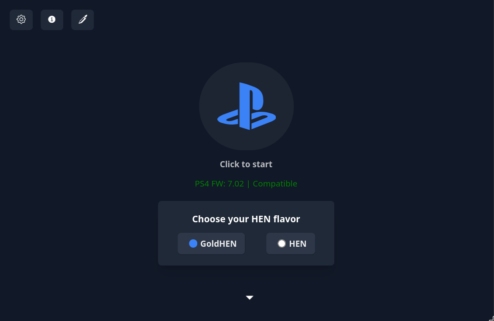
      <br>
      <b>Default Layout: Initial Screen</b>
    </td>
    <td align="center" style="border: none;">
      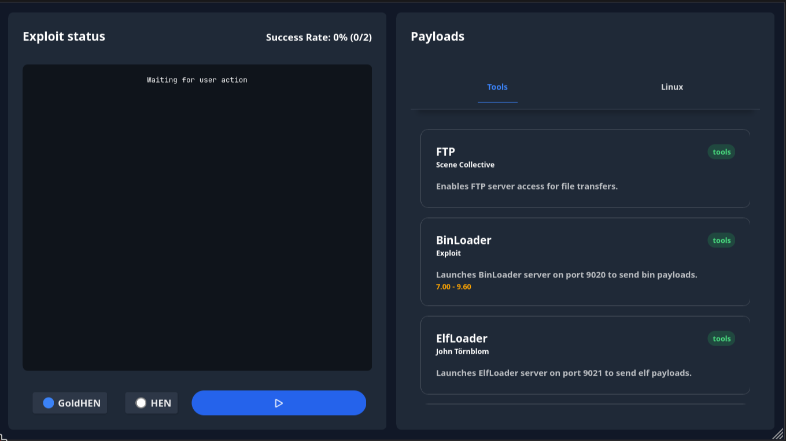
      <br>
      <b>Default Layout: Exploit Screen</b>
    </td>
  </tr>
  <tr>
    <td align="center" style="border: none;">
      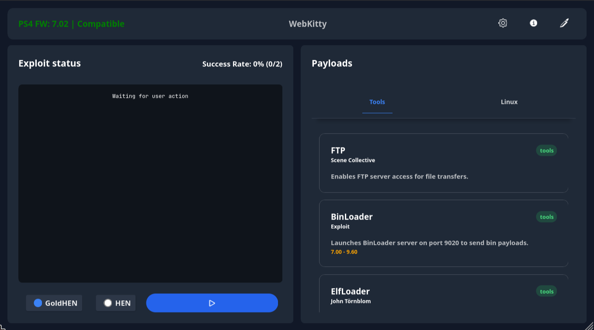
      <br>
      <b>Compact Layout (Combined)</b>
    </td>
    <td align="center" style="border: none;">
      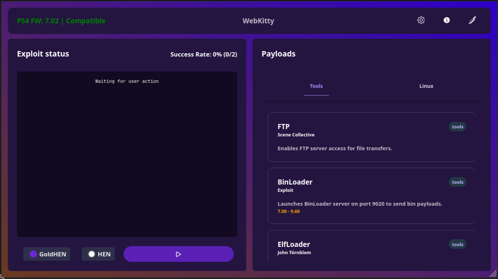
      <br>
      <b>Compact Layout (Vibrant)</b>
    </td>
  </tr>
  <tr>
    <td align="center" style="border: none;">
      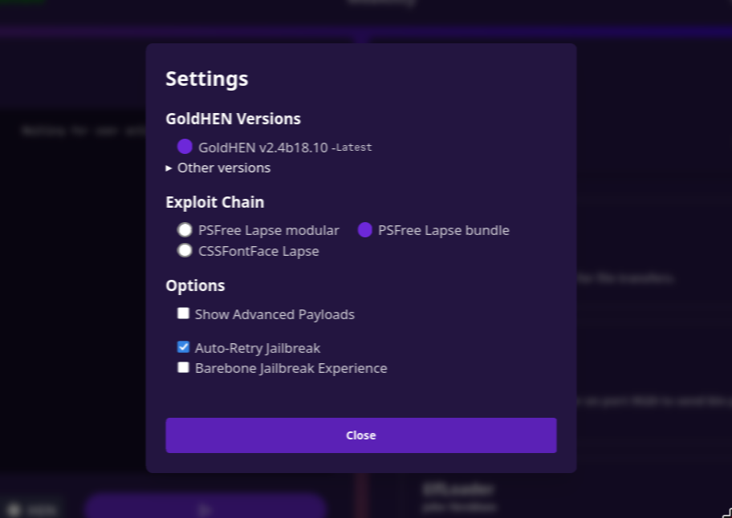
      <br>
      <b>Settings</b>
    </td>
    <td align="center" style="border: none;">
      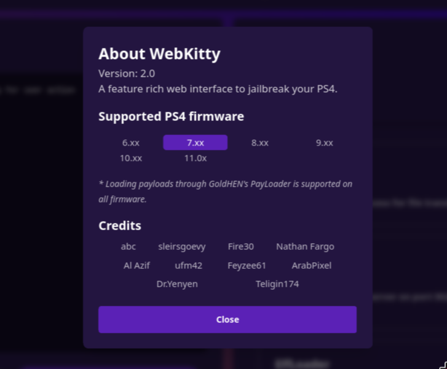
      <br>
      <b>About</b>
    </td>
  </tr>
  <tr>
    <td align="center" style="border: none;">
      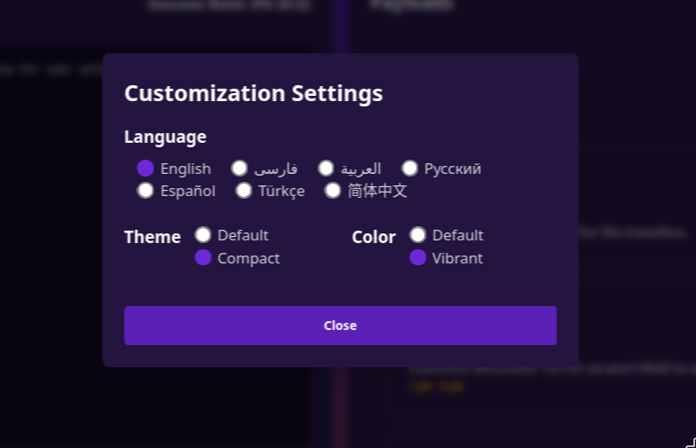
      <br>
      <b>Customization</b>
    </td>
    <td align="center" style="border: none;">
      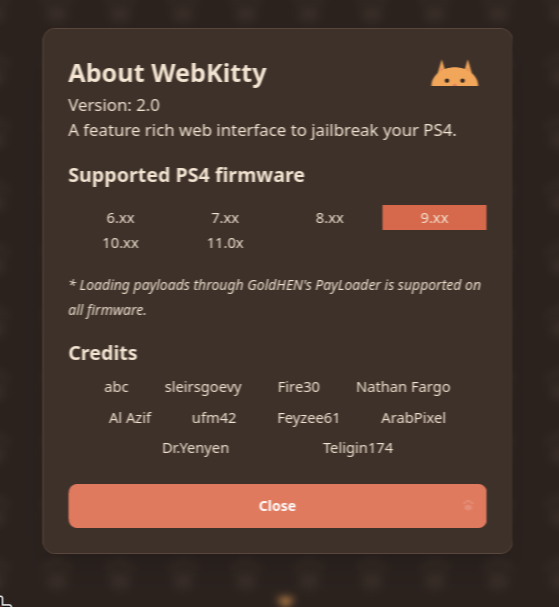
      <br>
      <b>About Catppuccino</b>
    </td>
  </tr>
  <tr>
    <td align="center" style="border: none;">
      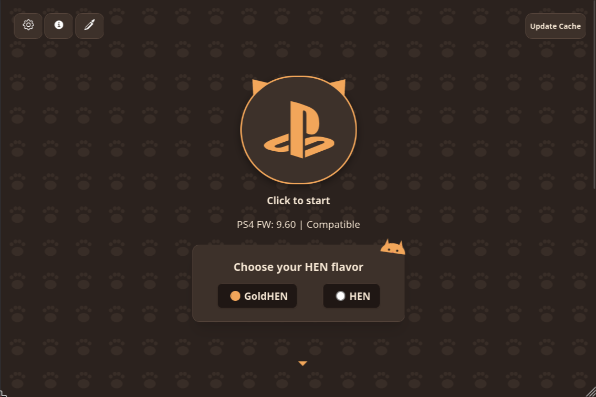
      <br>
      <b>Catppuccino: Initial Screen</b>
    </td>
    <td align="center" style="border: none;">
      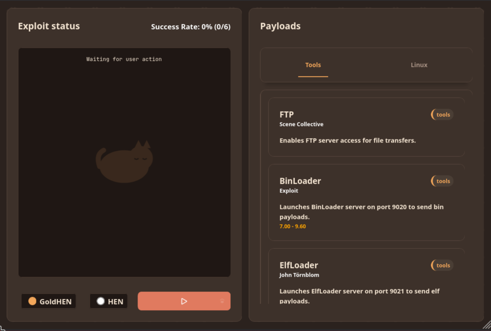
      <br>
      <b>Catppuccino: Exploit Screen</b>
    </td>
  </tr>
</table>

</details>

---

## Contribution

You can contribute to WebKitty by:
- Creating pull requests for new translations in the [`languages` folder](includes/js/languages).
- Modifying, updating, or implementing new host features.
- Reporting bugs or suggesting enhancements via [issues](https://github.com/ArabPixel/WebKitty/issues/new).
- In case your PR has edits inside `index.js file`, do not forget to generate `index-legacy.js` by typing
```
npm install # in case you didn't install them already.
npm run build
```

> **Important:** If your PR includes a new file, don't forget to add it to the respective firmware-based manifest files!

---

## Copyright and Authors

AGPL-3.0-or-later (see [LICENSE](LICENSE)). Part of this repo belongs to the group `anonymous`. We refer to anonymous contributors as "anonymous" as well.

---

## Credits
- **anonymous:** For PS4 firmware kernel dumps.
- **Flatz:** Duh
- **TheFlow:** For Netctrl kernel exploit.
- **abc:** For PSFree userland and Lapse kernel exploits.
- **sleirsgoevy:** For 6.7x kernel exploit. 
- **Fire30:** For Bad Hoist userland exploit.
- **Egycnq:**: Porting Netctrl to slopkit.
- **Jordy and Sonic-Iso:** Original Slopkit project.
- **Al-Azif:** For the modular (multi-file) PSFree Lapse and AIO workaround implementations.
- **Nathan Fargo and ufm42:** For CSSFontFace userland exploit.
- **ufm42:** For CSSFontFace Netctrl and Lapse implementation.
- **Feyzee61:** For the PSFree lapse bundle (single file) and 6.7x exploit implementations.
- Raw Game: For implementing a PS4 port for the Slopkit Lapse and Netctrl.
- **Dr.Yenyen:** For intensive multi-firmware testing.
- **Nazky:** For being the first host I took a peek at.
- **GattoDev:** For the WebKitty logo.
- **Payload developers:** For their payloads.

Check the appropriate files for any **extra** contributors. Unless otherwise stated, everything here can also be credited to us.
